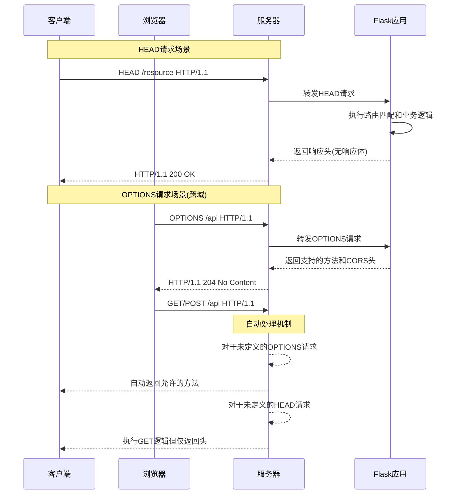

# HTTP请求处理流程 UML图

## 请求处理完整流程

```mermaid
title HTTP请求处理流程（包含HEAD和OPTIONS请求）

digraph G {
    subgraph "客户端层"
        A[用户/客户端] -->|发送HTTP请求| B[请求准备]
        B --> C1[GET请求] 
        B --> C2[POST请求]
        B --> C3[PUT/PATCH/DELETE请求]
        B --> C4[HEAD请求] 
        B --> C5[OPTIONS请求] 
    }

    subgraph "网络传输层"
        C1 --> D[HTTP协议封装]
        C2 --> D
        C3 --> D
        C4 --> D
        C5 --> D
        D --> E[网络传输]
    end

    subgraph "服务器处理层"
        E --> F[Web服务器接收]
        F --> G[WSGI/ASGI层]
        G --> H[Flask应用]
        H --> I[路由匹配]
        
        I -->|GET/POST等| J1[常规请求处理]
        I -->|HEAD| J2[HEAD请求特殊处理]
        I -->|OPTIONS| J3[OPTIONS请求特殊处理]
        
        J1 --> K1[视图函数执行]
        J2 --> K2[获取资源头信息]
        J3 --> K3[返回支持的HTTP方法]
        
        K1 --> L[响应生成]
        K2 --> L
        K3 --> L
    }

    subgraph "响应返回层"
        L --> M[响应数据封装]
        M --> N[网络传输]
        N --> O[客户端接收]
        O --> P[响应解析]
        P --> Q[用户展示/处理]
    }

    style J2 fill:#f9f,stroke:#333,stroke-width:2px
    style J3 fill:#f9f,stroke:#333,stroke-width:2px
}
```

## 关键环节说明

### 1. 客户端层

**核心作用**：生成并发送不同类型的HTTP请求。

**可执行操作**：
- 浏览器自动发送OPTIONS请求进行预检（特别是跨域场景）
- 应用程序使用HEAD请求检查资源状态
- 手动构造各类HTTP请求（如通过curl、Postman等工具）

### 2. 网络传输层

**核心作用**：负责请求的物理传输，确保数据完整性和可靠性。

**可执行操作**：
- 设置请求超时时间
- 配置重试机制
- 添加传输层安全（HTTPS）

### 3. 服务器处理层

#### 3.1 Web服务器接收与WSGI/ASGI层

**核心作用**：接收HTTP请求并转换为应用可处理的格式。

**可执行操作**：
- 配置请求缓冲区大小
- 设置连接超时
- 配置负载均衡（如Nginx、Apache等前端服务器）

#### 3.2 Flask应用处理

**核心作用**：应用核心逻辑处理，包括路由匹配和请求分发。

**可执行操作**：
- 添加中间件进行请求拦截和处理
- 实现自定义路由转换器
- 配置蓝图组织路由结构

#### 3.3 特殊请求处理

**HEAD请求处理**（高亮部分）：
- **核心作用**：执行与GET请求相同的路由和逻辑，但只返回响应头，不返回响应体
- **可执行操作**：
  - 用于资源状态检查（如是否存在、最后修改时间）
  - 用于获取资源大小信息（Content-Length）
  - 实现缓存验证

**OPTIONS请求处理**（高亮部分）：
- **核心作用**：返回目标资源支持的所有HTTP方法和通信选项
- **可执行操作**：
  - 实现CORS跨域支持（返回Access-Control-*头）
  - 自定义允许的HTTP方法列表
  - 添加API功能描述信息

### 4. 响应返回层

**核心作用**：将处理结果封装为HTTP响应并返回给客户端。

**可执行操作**：
- 添加自定义响应头
- 设置缓存控制策略
- 实现内容压缩
- 配置响应状态码

## HEAD和OPTIONS请求的特殊场景



## 代码优化建议

在Flask应用中处理特殊请求的最佳实践：

```python
from flask import Flask, request, jsonify

app = Flask(__name__)

# 1. 自动处理模式 - 默认行为
@app.route('/resource', methods=['GET', 'POST'])
def resource():
    # Flask会自动处理对应的HEAD请求
    # 对于OPTIONS请求会自动返回支持的方法
    if request.method == 'GET':
        return jsonify({"data": "resource content"})
    elif request.method == 'POST':
        return jsonify({"status": "created"}), 201

# 2. 自定义OPTIONS处理
@app.route('/custom-options', methods=['GET', 'POST', 'OPTIONS'])
def custom_options():
    if request.method == 'OPTIONS':
        # 自定义OPTIONS响应
        response = jsonify({"allowed_methods": ["GET", "POST", "OPTIONS"], "api_version": "v1"})
        response.headers['Access-Control-Allow-Origin'] = '*'
        response.headers['Access-Control-Allow-Methods'] = 'GET, POST, OPTIONS'
        response.headers['Access-Control-Allow-Headers'] = 'Content-Type, Authorization'
        return response, 200
    # 处理GET和POST请求...
    return jsonify({"message": "Handled GET/POST"})

# 3. 使用装饰器简化CORS处理
@app.after_request
def add_cors_headers(response):
    response.headers['Access-Control-Allow-Origin'] = '*'
    if request.method == 'OPTIONS':
        response.headers['Access-Control-Allow-Methods'] = 'GET, POST, PUT, DELETE, OPTIONS'
        response.headers['Access-Control-Allow-Headers'] = 'Content-Type, Authorization'
    return response
```

## 输入输出示例

#### 输入输出示例

**HEAD请求示例**：

输入：
```bash
curl -I http://localhost:5000/resource
```

输出：
```
HTTP/1.1 200 OK
Content-Type: application/json
Content-Length: 26
Server: Werkzeug/2.0.1 Python/3.9.0
Date: Wed, 27 Sep 2025 12:34:56 GMT
```

**OPTIONS请求示例**：

输入：
```bash
curl -X OPTIONS -i http://localhost:5000/resource
```

输出：
```
HTTP/1.1 200 OK
Allow: GET, HEAD, OPTIONS, POST
Content-Type: text/html; charset=utf-8
Content-Length: 0
Server: Werkzeug/2.0.1 Python/3.9.0
Date: Wed, 27 Sep 2025 12:34:56 GMT
```